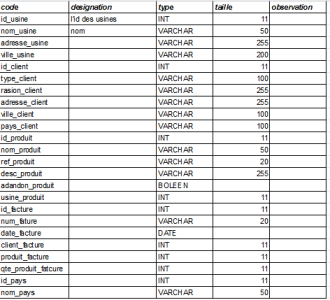
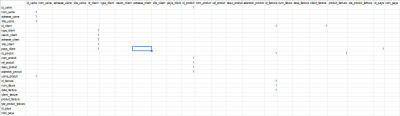

# IKEO ###
### Guillaume, Erwan, Batiste, Ronan

 

* ### Le dictionnaire des données

   

* ### Les dépendances fonctionnelles

   

### Le schéma entité-association

   

### Le MLD

### Base Exportée

source/Ikeo.mysql</a>

### Les requête SQL
<a href="source/mysql/cmd_mysql.md">lien</a>